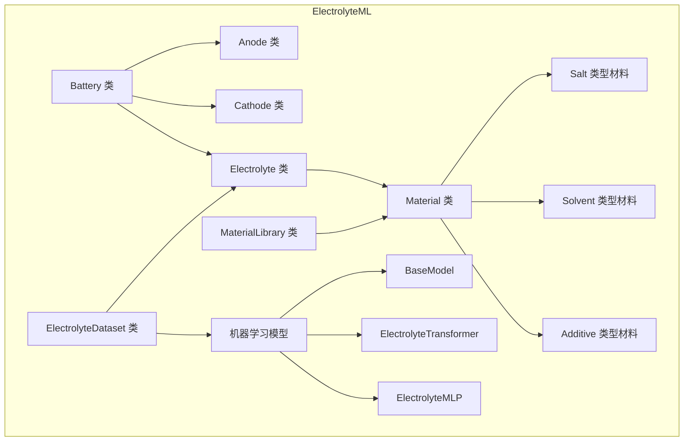

# 基于机器学习的电池电解液性能预测与配方优化系统


## 项目概述

本项目是一个结合材料科学与人工智能技术的研究工具，专注于锂离子电池电解液性能预测与配方优化。该项目利用分子特征提取、材料属性标准化和深度学习模型，基于材料的基础物性，实现电解液性能的精准预测，为电池研发提供高效的计算辅助工具。

## 功能特点

- **电解液材料库**
  - 支持锂盐、溶剂、添加剂三大类材料管理
  - 基于RDKit的分子结构特征自动提取
  - 材料属性标准化和范围限制
  - 内置数据库包含常用电解液材料物性数据
- **电解液配方系统**
  - 灵活的组分配比和材料组合
  - 基于占比的配方特征向量生成
  - 配方序列化和反序列化支持
- **电解液性能预测**
  - 基于Transformer架构的电解液电导率、粘度预测
  - 融合分子指纹、物理化学性质的多模态特征学习
  - 训练-验证-测试完整评估流程
- **电池整体性能预测**
  - 可扩展分析电池正负极材料
  - 综合电解液配方、正负极材料对电池整体性能进行预测
  - 实现通过材料物性直接预测电池整体性能
- **可视化与分析**
  - 配方性能比较与分析
  - 结构-性能关系可视化
  - 实验数据与预测结果对比

## 技术实现

- **材料表示**: 使用MACCS分子指纹和物理化学性质
- **内存优化**: 采用对象池模式避免重复材料实例
- **模型架构**: 基于Transformer的序列特征学习
- **数据验证**: 使用Pydantic进行严格的数据类型检查
- **模块解耦**：对电池-电解液-材料三部分进行解耦

## 安装

### 环境要求

- Python 3.12+
- PyTorch 1.8+
- RDKit
- Pydantic 2.0+

### 安装步骤

```bash
# 安装依赖
# 方法 1: 使用 uv 安装 （推荐）
# uv: https://docs.astral.sh/uv/getting-started/installation/
uv sync

# 方法 2: 使用 pip 安装 
pip install -e .
```

## 项目架构

```
ElectrolyteML/
├── battery/                 # 电池相关模块
│   ├── models.py            # 电池数据模型
│   ├── anode.py             # 电池正极类
│   ├── cathode.py           # 电池父极类
│   └── electrolyte.py       # 电解液类实现
├── material/                # 材料相关模块
│   ├── models.py            # 材料数据模型
│   └── __init__.py          # 材料类实现与库管理
├── ml/                      # 机器学习模块
│   ├── models.py            # 神经网络模型定义
│   └── training.py          # 训练和评估函数
├── dataset/                 # 数据集管理
│   └── __init__.py          # 数据集类实现
├── database/                # 数据文件
│   ├── materials.json       # 材料库
│   └── electrolytes.json    # 电解液配方库
├── config/                  # 项目配置模块
│   └── __init__.py          # 项目配置文件
└── README.md                # 项目说明
```




## 模块说明

### 1. Battery 模块

**功能：**
- 实现电池组件的数据结构和行为
- 包含电池整体及其组成部分（正极、负极、电解液）
- 提供电池性能数据的存取和管理

**主要组件：**
- Battery 类：电池整体表示，集成了正极、负极和电解液
- `Anode` 类：负极组件
- `Cathode` 类：正极组件
- `BatteryModel`/`AnodeModel`/`CathodeModel` 数据模型：定义数据结构和验证规则

**使用示例：**
```python
from battery import Battery, BatteryModel

# 创建电池实例
battery = Battery(battery_model_data)

# 访问电池组件
print(f"电池名称: {battery.name}")
print(f"正极: {battery.cathode}")
print(f"负极: {battery.anode}")
print(f"电解液: {battery.electrolyte}")
```

### 2. Electrolyte 模块

**功能：**
- 电解液配方的创建和管理
- 支持锂盐、溶剂和添加剂的组合配比
- 生成电解液特征向量用于性能预测
- 序列化和可视化电解液配方

**主要组件：**
- `Electrolyte` 类：电解液配方的完整表示
- `ElectrolyteModel` 数据模型：定义电解液数据结构和校验规则
- `Component` 类：表示电解液中的组分及其配比

**使用示例：**
```python
from battery import Electrolyte
from material import MLibrary

# 创建电解液配方
electrolyte = Electrolyte.create(
    name="LP30",
    id="standard-1",
    description="标准LiPF6/EC/DMC电解液",
    salts=[
        {"abbr": "LiPF6", "cas_registry_number": "21324-40-3", "overall_fraction": 10.0}
    ],
    solvents=[
        {"abbr": "EC", "cas_registry_number": "96-49-1", "relative_fraction": 50.0},
        {"abbr": "DMC", "cas_registry_number": "616-38-6", "relative_fraction": 50.0}
    ],
    additives=[],
    performance={"ionic_conductivity": 10.5}
)

# 显示配方详情
electrolyte.show()
```

### 3. MaterialLibrary 模块

**功能：**
- 材料数据库的管理和访问
- 支持锂盐、溶剂、添加剂三大类材料
- 材料属性的标准化和验证
- 材料分子特征的提取

**主要组件：**
- Material 类：材料通用表示
- `MaterialLibrary` 类：材料库管理
- `MLibrary` 全局实例：提供统一的材料访问接口
- 各种材料模型类：`SaltModel`、`SolventModel`、`AdditiveModel` 等

**使用示例：**
```python
from material import MLibrary

# 获取特定材料
lipf6 = MLibrary.get_material("LiPF6", "21324-40-3")
ec = MLibrary.get_material("EC", "96-49-1")

# 查看材料属性
print(f"LiPF6 密度: {lipf6.density} g/cm³")
print(f"EC 介电常数: {ec.dielectric_constant}")
```

### 4. Dataset 模块

**功能：**
- 电解液数据集的加载和处理
- 构建特征矩阵和目标值
- 模型的训练和评估
- 电解液性能预测
- 配方优化辅助

**主要组件：**
- `ElectrolyteDataset` 类：数据集管理和机器学习功能集成

**使用示例：**
```python
from dataset import ElectrolyteDataset

# 加载数据集
dataset = ElectrolyteDataset("data/calisol23.json")

# 训练模型
history = dataset.train_model(
    model="transformer", 
    model_config={"hidden_dim": 256, "n_layers": 2, "n_heads": 2},
    epochs=100,
    save_path="best_model.pth"
)

# 预测电解液性能
conductivity = dataset.predict(electrolyte)
print(f"预测电导率: {conductivity:.4f} mS/cm")
```

### 5. ML 模块

**功能：**
- 定义用于电解液性能预测的机器学习模型
- 提供不同架构的神经网络模型
- 支持模型参数配置

**主要组件：**
- `BaseModel`：模型基类
- `ElectrolyteTransformer`：基于Transformer架构的模型
- `ElectrolyteMLP`：多层感知器模型

**使用示例：**
```python
from ml import ElectrolyteTransformer

# 创建模型（通常通过dataset.train_model间接使用）
model = ElectrolyteTransformer(
    input_dim=128,
    hidden_dim=256,
    n_layers=2,
    n_heads=4
)

# 使用特定模型进行训练
dataset.train_model(
    model=model,
    epochs=100
)
```

## 使用指南

### 加载材料库

```python
from material import MaterialLibrary

# 初始化材料库
MLibrary = MaterialLibrary("database/materials.json")
print(f"材料库加载完成，共 {len(MLibrary)} 种材料")
```

### 创建电解液配方

```python
from battery import Electrolyte, ElectrolyteModel
from material import MLibrary

# 获取材料
lipf6 = MLibrary.get_material("LiPF6", "21324-40-3")
ec = MLibrary.get_material("EC", "96-49-1")
dmc = MLibrary.get_material("DMC", "616-38-6")

# 创建配方
electrolyte = Electrolyte.create(
    name="LP30",
    description="标准LiPF6/EC/DMC电解液",
    salts=[
        {"material": lipf6, "overall_fraction": 10.0}
    ],
    solvents=[
        {"material": ec, "relative_fraction": 50.0},
        {"material": dmc, "relative_fraction": 50.0}
    ]
)

# 显示配方详情
electrolyte.show()
```

### 预测电解液性能

```python
from dataset import ElectrolyteDataset

# 加载数据集
dataset = ElectrolyteDataset("database/electrolytes.json")

# 训练模型
history = dataset.train_model(
    model="transformer", 
    model_config={"hidden_dim": 256, "num_heads": 8},
    epochs=100
)

# 预测性能
ionic_conductivity = dataset.predict(electrolyte)
print(f"预测电导率: {ionic_conductivity:.4f} mS/cm")
```

## 示例用例

### 批量预测

```python
# 批量预测多个配方的性能
results = {}
for recipe in dataset.get_test_recipes():
    conductivity = dataset.predict(recipe)
    results[recipe.name] = conductivity
    
# 排序找出最佳配方
best_recipes = sorted(results.items(), key=lambda x: x[1], reverse=True)
for name, value in best_recipes[:5]:
    print(f"{name}: {value:.4f} mS/cm")
```

### 配方优化

```python
# 基于已有配方进行微调和优化
new_recipe = electrolyte.clone()
new_recipe.adjust_salt_fraction(15.0)  # 增加盐的含量到15%
new_conductivity = dataset.predict(new_recipe)

print(f"原配方电导率: {dataset.predict(electrolyte):.4f} mS/cm")
print(f"优化后电导率: {new_conductivity:.4f} mS/cm")
```

## 
